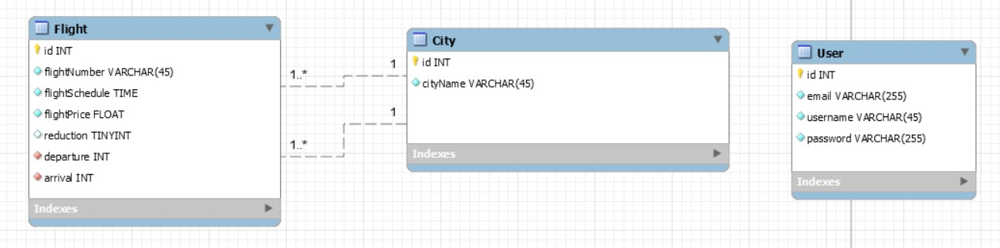

# ANALYSE DU PROJET

Une cie de vols privés propose des trajets VIP vers des capitales européennes.
Une app avec:
    - Un système de login, avec 2 types d'utilisateurs (USER, ADMIN).
    - Un espace privé qui affiche les vols et propose des actions pour:
        > Créer un nouveau vol
        > Modifier un vol
        > Voir les vols
        > Supprimer des vols

L'application à ce stade permet de gérer les vols de la journée courante.

## Analyse fonctionnelle:
À faire...
- Compréhensible voir dicté par le client.
- Peut donner lieu à un Use Case UML. 

## Couche métier:
- Dégager les types de données.
- Ici:
    1. Vol || trajet
    2. Capitales
    3. User

## Modélisation DB:
- Un diagramme de classes UML basé sur l'analyse fonctionnelle.
- On va créer un diagramme MySQL WorkBench.

## Configuration de l'application:
1. Database
2. Entités et relations
    > Ne pas faire User!
3. Fixtures:
    - Créer un tableau d'objets du type City
    - Créer un ou deux vols:
        > Numéro de vol statique, exemple: AH2349
__NB__: Éviter le copier-coller de code.